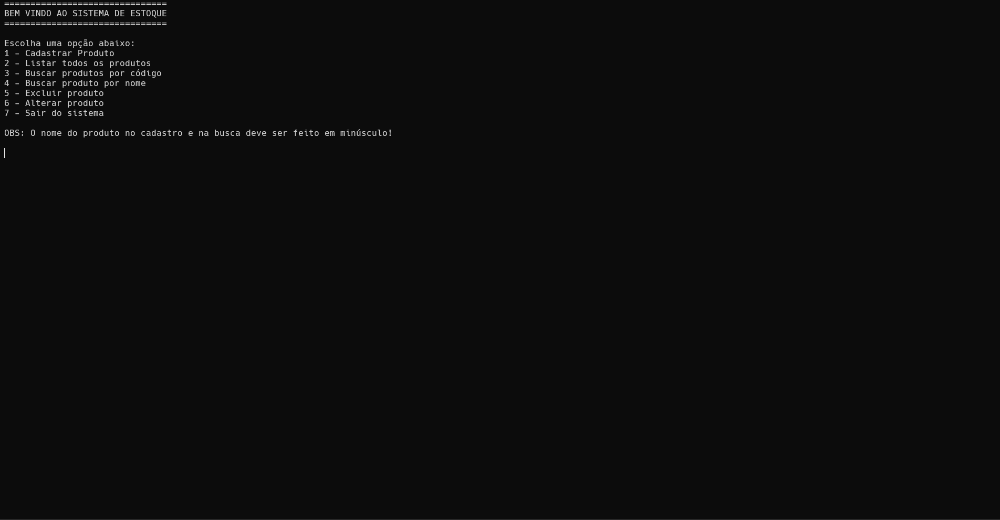
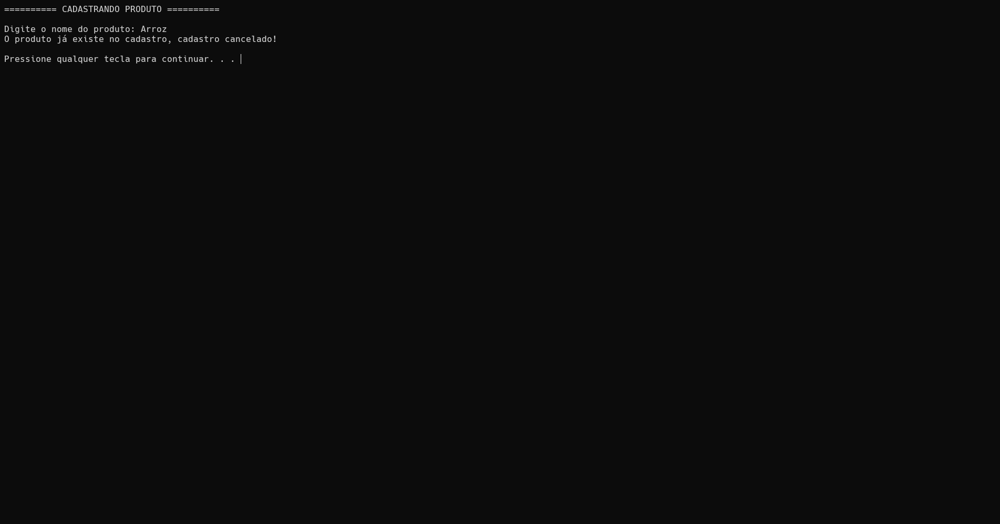

📦 Sistema de Gerenciamento de Estoque

Sistema de gerenciamento de estoque desenvolvido em linguagem C, com interface via terminal.

📋 Funcionalidades

- Cadastrar produtos (nome, quantidade e código)
- Listar todos os produtos cadastrados
- Buscar produto por código
- Buscar produto por nome
- Editar informações de um produto
- Excluir produto do estoque
- Validação de duplicidade por nome e código

🛠️ Tecnologias utilizadas

- Linguagem C
- Structs e ponteiros
- Alocação dinâmica de memória (malloc)
- Compatível com Windows e Linux

👨‍💻 Autores

- Guilherme Belo Fontes
- Pedro Henrique Sampaio Alves
- Lícia Torres Araújo Freires
- José Deyvid Monteiro Pereira

📸 Screenshots

Menu principal

Cadastrando produto

Validação de duplicidade

Listagem de produtos

Busca por nome

>>>>>>> master
